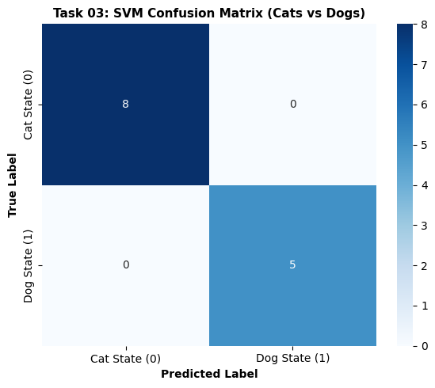

# 🐱🐶 Task 03: Cats vs Dogs Image Classification using Support Vector Machine (SVM)

## 📌 Project Overview
**Company:** Prodigy InfoTech  
**Intern Name:** Subham Kumar Swain  
**Track:** Machine Learning (`PRODIGY_ML_03`)  

---

## 🎯 Task Objective
Implement a Support Vector Machine (SVM) classification algorithm to accurately classify images of Cats and Dogs.

---

## 🛠️ Tech Stack & Methodology
* **Language:** Python
* **Model Used:** Support Vector Classifier (`SVC` with RBF Kernel)
* **Libraries Used:** `scikit-learn`, `numpy`, `matplotlib`, `seaborn`, `tensorflow.keras`
* **Preprocessing:** Image normalization and 1D Feature Flattening.

---

## 📊 Visualizations

