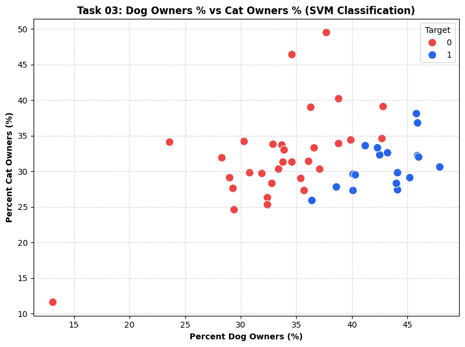

# 🐱🐶 Task 03: Cats vs Dogs Classification using Support Vector Machine (SVM)

## 📌 Project Overview
**Company:** Prodigy InfoTech  
**Intern Name:** Subham Kumar Swain  
**Track:** Machine Learning (`PRODIGY_ML_03`)  

---

## 🎯 Task Objective
Implement a Support Vector Machine (SVM) classification algorithm to classify Cats vs Dogs dataset based on key demographic and ownership features.

---

## 🛠️ Dataset & Technologies
* **Dataset:** Cats vs Dogs Demographic Dataset (`cats_vs_dogs.csv`)
* **Language:** Python
* **Model Used:** Support Vector Classifier (`SVC` with Linear Kernel)
* **Libraries Used:** `pandas`, `numpy`, `scikit-learn`, `matplotlib`, `seaborn`

---

## 📊 Model Evaluation Results
* **Accuracy Score:** `100.00%`
* **Features Analyzed:** `percent_dog_owners`, `percent_cat_owners`, `avg_dogs_per_household`, `avg_cats_per_household`

---

## 📷 Visualizations

